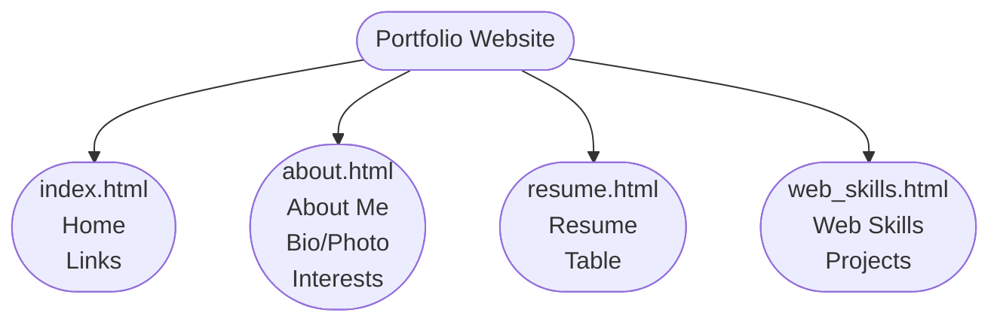

# Concept Map




# Storyboard (one per page)

```
+------------------------------------------+
|           HEADER / LOGO + NAME           |
+------------------------------------------+
| [Home] | [About] | [Resume] | [Skills]   |  ← Horizontal nav bar
+------------------------------------------+
|                                          |
|         MAIN CONTENT AREA                |
|   - Headings (h1, h2, h3...)             |
|   - Paragraphs                           |
|   - Images                               |
|   - Lists (ordered / unordered)          |
|                                          |
+------------------------------------------+
|              FOOTER                      |
|   Email | Phone | Copyright              |
+------------------------------------------+
```


# Folder Structure

```
Portfolio/
├── index.html
├── rroy_A2_about.html
├── rroy_A2_resume.html
├── rroy_A2_web_skills.html
├── css/
│   └── portfolio.css
├── images/
│   └── certificate.png, profile.png, work.png, etc.
```